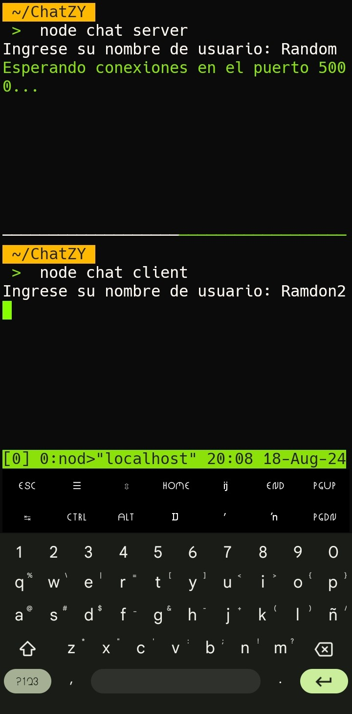

## ChatZY 
**Es un mini-script para chatear desde la consola.**

|||
|----------|----------|


>[!WARNING]
>Es necesario instalar _Node.js_
```
pkg install nodejs
```
Luego de instalar _Node.js_ hay que instalar _NMAP_ 
```
pkg install nmap
```

- **INSTALA GIT** si no lo tienes.
  ```
  pkg install git
  ```
  
>[!IMPORTANT]
>Clona el repositorio, (o descárgalo)
```
git clone https://github.com/Jmahyals/ChatZY/
```

- Luego ve a la carpeta /chatZY
```
cd ChatZY
```

Para finalizar instala `Chalk` para los colores:
```
npm install chalk@4
```

**Y listo**, solo falta ejecutar el script.
`node chat server` y `node chat client`; escoje uno depende cuál sea tu rol...

>[!NOTE]
>Promero debes activar el server:
```
node chat server
```

Y el otro dispositivo debe conectarse con:
```
node chat client
```
